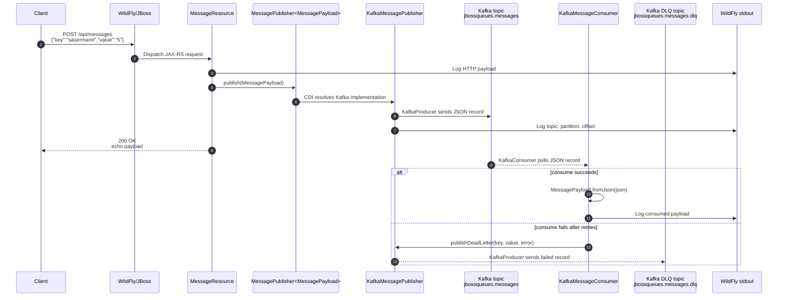

# jbossqueues

Minimal Jakarta EE service shell packaged as a WAR for WildFly.

## Build

```sh
mvn package
```

The deliverable is written to `target/jbossqueues.war`.

## Docker image

```sh
make docker-build
```

By default the image name is:

```text
ghcr.io/h4rkon/jbossqueues:<VERSION>
```

The image tag is read from `VERSION`. Override `IMAGE_REGISTRY`, `IMAGE_OWNER`,
`VERSION`, `IMAGE_TAG`, or `IMAGE` when building for another registry or tag.

For a new rollout version:

```sh
make bump-version
make print-image
make docker-build
make docker-push
```

## Push

Log in to GitHub Container Registry first. `GHCR_USER` is your GitHub user or
organization account, and the token must have `write:packages` permission.

```sh
GHCR_TOKEN=<github-token> make docker-login GHCR_USER=<github-user-or-org>
```

For local development, you can also store the token in a gitignored file:

```sh
mkdir -p .secret
printf '%s' '<github-token>' > .secret/.gitpat
chmod 600 .secret/.gitpat
make docker-login GHCR_USER=<github-user-or-org>
```

Do not commit `.secret/`. The folder is ignored by Git.

Build and push the exact image name that your Kubernetes deployment will use:

```sh
make docker-build
make docker-push
```

If push fails with `permission_denied: create_package`, the token is valid but
GitHub is not allowing that user to create the package under `IMAGE_OWNER`.
Use an owner that your GitHub user can publish to, or grant package creation
permission in the GitHub organization.

To confirm the full image name before pushing:

```sh
make print-image
```

## Run locally

```sh
make run
curl http://localhost:8080/api/messages
curl -X POST http://localhost:8080/api/messages \
  -H 'Content-Type: application/json' \
  -d '{"key":"sauermann","value":"5"}'
```

## Kafka Messaging

Kafka is configured through environment variables. The Kubernetes deployment
should set these values explicitly:

```text
KAFKA_BOOTSTRAP_SERVERS=kafka.kafka.svc.cluster.local:9092
KAFKA_TOPIC_MESSAGES=jbossqueues.messages
KAFKA_TOPIC_MESSAGES_DLQ=jbossqueues.messages.dlq
KAFKA_CONSUMER_GROUP=jbossqueues-demo
```

The app publishes every `POST /api/messages` payload to Kafka and runs a
Kafka consumer in the same WildFly deployment.

Resilience is handled in two places:

- producer retry/circuit breaker: MicroProfile Fault Tolerance annotations
- Kafka client retry: Kafka producer/consumer client properties
- consumer DLQ: failed consumed records are written to `KAFKA_TOPIC_MESSAGES_DLQ`

### Runtime Flow



### Container Wiring


