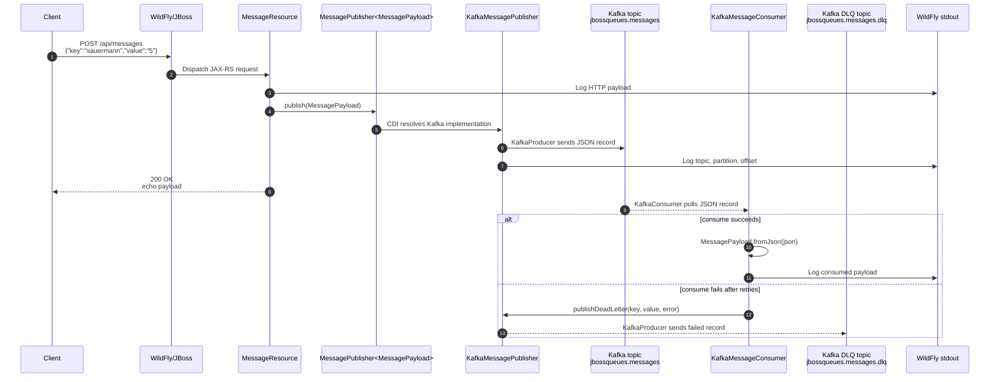
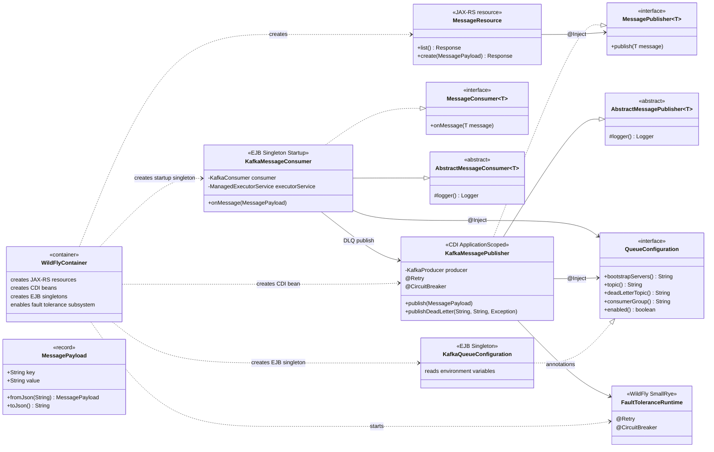

# jbossqueues

Minimal Jakarta EE service packaged as a WAR for WildFly. It exposes a REST
endpoint, publishes posted messages to Kafka, and consumes the same Kafka topic
inside the same WildFly deployment.

## Build

```sh
mvn package
```

The deliverable is written to `target/jbossqueues.war`.

## Docker image

```sh
make docker-build
```

By default the image name is:

```text
ghcr.io/h4rkon/jbossqueues:<VERSION>
```

The image tag is read from `VERSION`. Override `IMAGE_REGISTRY`, `IMAGE_OWNER`,
`VERSION`, `IMAGE_TAG`, or `IMAGE` when building for another registry or tag.

For a new rollout version:

```sh
make bump-version
make print-image
make docker-build
make docker-push
```

## Push

Log in to GitHub Container Registry first. `GHCR_USER` is your GitHub user or
organization account, and the token must have `write:packages` permission.

```sh
GHCR_TOKEN=<github-token> make docker-login GHCR_USER=<github-user-or-org>
```

For local development, you can also store the token in a gitignored file:

```sh
mkdir -p .secret
printf '%s' '<github-token>' > .secret/.gitpat
chmod 600 .secret/.gitpat
make docker-login GHCR_USER=<github-user-or-org>
```

Do not commit `.secret/`. The folder is ignored by Git.

Build and push the exact image name that your Kubernetes deployment will use:

```sh
make docker-build
make docker-push
```

If push fails with `permission_denied: create_package`, the token is valid but
GitHub is not allowing that user to create the package under `IMAGE_OWNER`.
Use an owner that your GitHub user can publish to, or grant package creation
permission in the GitHub organization.

To confirm the full image name before pushing:

```sh
make print-image
```

## Run locally

```sh
make run
curl http://localhost:8080/api/messages
curl -X POST http://localhost:8080/api/messages \
  -H 'Content-Type: application/json' \
  -d '{"key":"sauermann","value":"5"}'
```

## Kafka Messaging

Kafka is configured through environment variables. The Kubernetes deployment
should set these values explicitly:

```text
KAFKA_BOOTSTRAP_SERVERS=kafka.kafka.svc.cluster.local:9092
KAFKA_TOPIC_MESSAGES=jbossqueues.messages
KAFKA_TOPIC_MESSAGES_DLQ=jbossqueues.messages.dlq
KAFKA_CONSUMER_GROUP=jbossqueues-demo
```

The app publishes every `POST /api/messages` payload to Kafka and runs a
Kafka consumer in the same WildFly deployment.

The queue-facing application code is intentionally structured around small
interfaces and container-managed services:

- `MessageResource` handles HTTP only.
- `MessagePublisher<T>` and `MessageConsumer<T>` define the queue-facing
  contract without exposing Kafka to the REST layer.
- `KafkaMessagePublisher`, `KafkaMessageConsumer`, and
  `KafkaQueueConfiguration` are the current Kafka-specific adapter.
- WildFly/JBoss creates and connects the services through CDI and EJB lifecycle
  management. The Kafka consumer is an eager `@Singleton @Startup` bean, and
  configuration is an EJB singleton.

Resilience is handled in two places:

- producer retry/circuit breaker: MicroProfile Fault Tolerance annotations
- Kafka client retry: Kafka producer/consumer client properties
- consumer DLQ: failed consumed records are written to `KAFKA_TOPIC_MESSAGES_DLQ`

### MicroProfile Note

MicroProfile Reactive Messaging may still be a good future option, but it needs
more investigation in this WildFly setup. The previous Reactive Messaging
attempt logged successful publishes while records were not visible to Kafka
consumers. For the current working version, the app keeps the SOLID interface
structure and uses direct Kafka clients behind that boundary.

MicroProfile Fault Tolerance is still used for the producer retry and circuit
breaker behavior.

### Runtime Flow



### Container Wiring



## Verification

With the Kubernetes service port-forwarded:

```sh
kubectl -n jbossqueues port-forward svc/jbossqueues 8181:8181
```

Check the endpoint:

```sh
curl http://127.0.0.1:8181/api/messages
```

Expected response:

```json
[]
```

Post a message:

```sh
curl -X POST http://127.0.0.1:8181/api/messages \
  -H 'Content-Type: application/json' \
  -d '{"key":"sauermann","value":"5"}'
```

Expected response:

```json
{"key":"sauermann","value":"5"}
```

The application log should show both publish and consume lines:

```text
Published Kafka message to jbossqueues.messages-0 offset ...
Consumed Kafka message from jbossqueues.messages-0 offset ...
Consumed Kafka message payload: {"key":"sauermann","value":"5"}
```

Check the consumer group:

```sh
kubectl -n kafka exec kafka-controller-0 -- \
  /opt/bitnami/kafka/bin/kafka-consumer-groups.sh \
  --bootstrap-server localhost:9092 \
  --describe --group jbossqueues-demo
```

Expected result: `LAG` should be `0`.

## Implementation Map

Logic:

- REST API: `src/main/java/dev/hzd/jbossqueues/MessageResource.java`
- Payload JSON conversion: `src/main/java/dev/hzd/jbossqueues/MessagePayload.java`
- Queue contracts: `src/main/java/dev/hzd/jbossqueues/queue/MessagePublisher.java`,
  `MessageConsumer.java`, and `QueueConfiguration.java`
- Shared base classes: `AbstractMessagePublisher.java` and
  `AbstractMessageConsumer.java`
- Kafka adapter:
  `src/main/java/dev/hzd/jbossqueues/queue/kafka/KafkaMessagePublisher.java`,
  `KafkaMessageConsumer.java`, and `KafkaQueueConfiguration.java`

Build and container:

- Maven WAR build and dependencies: `pom.xml`
- WildFly image build: `Dockerfile`
- WildFly subsystem/listener configuration: `configure-wildfly.cli`
- Versioned image tag: `VERSION`
- Build/push commands: `Makefile`

Runtime configuration:

- App namespace/deployment should provide `KAFKA_BOOTSTRAP_SERVERS`,
  `KAFKA_TOPIC_MESSAGES`, and `KAFKA_TOPIC_MESSAGES_DLQ`.
- Kafka must have the topics `jbossqueues.messages` and
  `jbossqueues.messages.dlq`.
- Single-node Kafka must set internal topic replication factors to `1`,
  especially `offsets.topic.replication.factor=1`, so consumer groups work.
